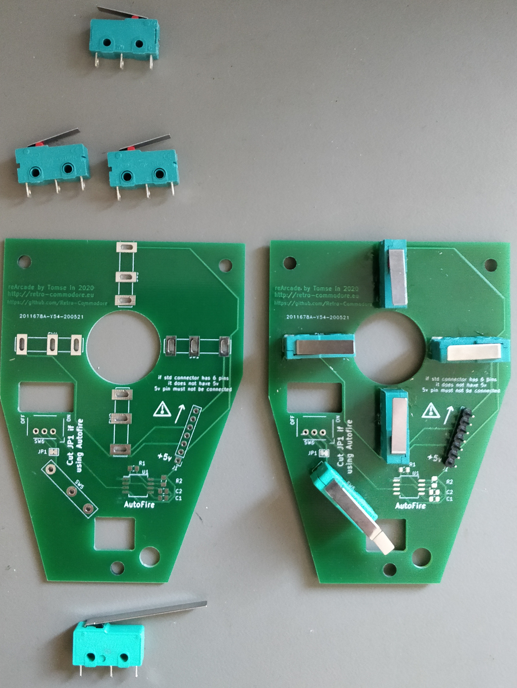

# RCEU530-reArcade
 new Arcade PCB with autofire

reArcade is an all microswitch drop-in replacement PCB for the Arcade joystick.
Added is the possibility of an autofire using a 555 timer.
Microswtich in firebutton - in case you don't want to modify the original pcb.

In order to use autofire, a new cable is required which supplies 5v.

# BOM
4x Microswitches with regular size arm [eBay](https://www.ebay.com/itm/10-X-KW4-3Z-3-Hinge-Roller-Lever-SPDT-Momentary-Micro-Limit-Switch-3D-printer/122688679006).
1x Microswitch with long arm [eBay](https://www.ebay.com/itm/5Pcs-AC250-125V-5A-3P-Momentary-36mm-Lever-Arm-Micro-Switch-Green-KW12-9S/233272820914).
1x 1x7 pin male pinheader

**Optional Autofire**
1x on/off switch

1x SMD 0805 Resistor 33k

1x SMD 0805 Resistor 4k7

2x SMD 0805 Capacitor 10nF

1x SMD 555 timer

1x Joystick cable with 5v (min 7 wire cable, DB9 female, 1x7 pin female connector 2.54mm - or just get a finished extension cable on ebay).

